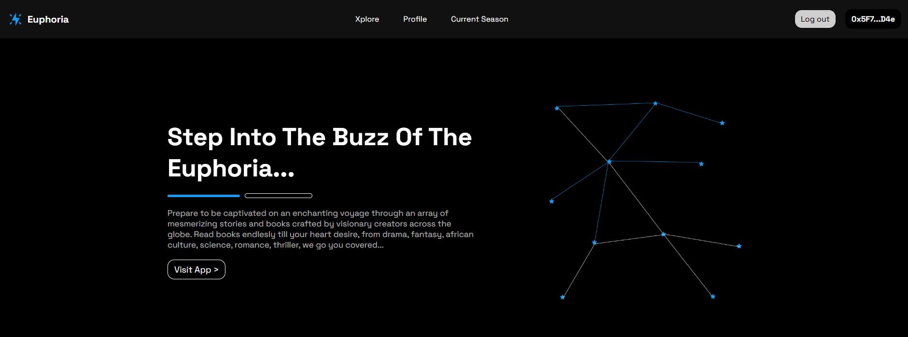
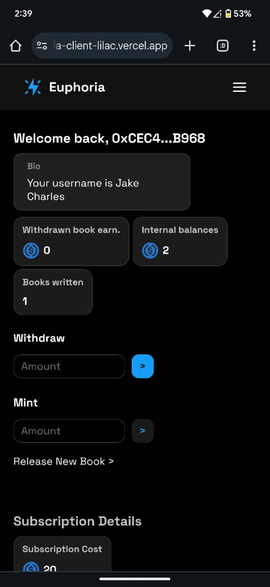
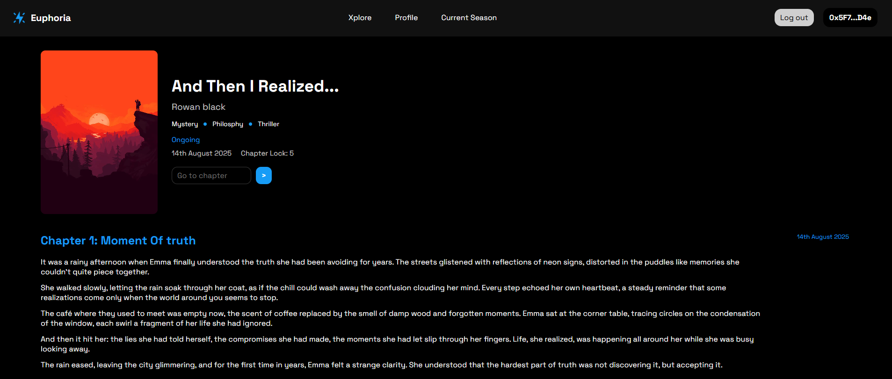
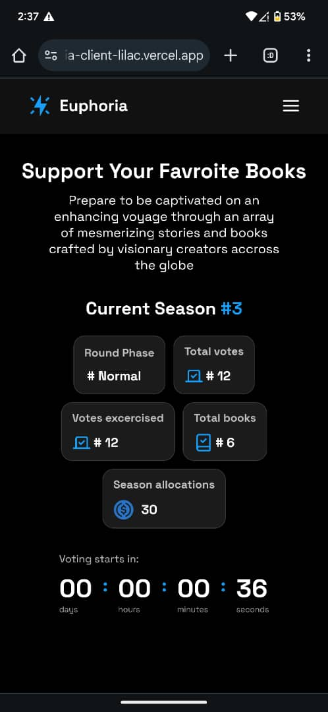

# Euphoria Project Presentation

# Links

- [Youtube video demo](https://youtu.be/qS_tl0Nudao)
- [Smart Contract Repository](https://github.com/franfran20/euphoria_contracts)
- [Server Repsoitory](https://github.com/franfran20/euphoria_server)
- [Frontend Repository](https://github.com/franfran20/euphoria_client)
- [Live Demo](https://euphoria-client-lilac.vercel.app/)

### **What is Euphoria?**

Euphoria is an decentralized writing social platform built on Morph. It was built to be a bridge betwen creative writers and book enthusiats. Where these groups of people easily come together to do what they both want, which is read and write.

Euphoria is way more than that tho, Its a platform built with writers in mind, especially when it comes to incentivization. You see, writers are underpaid in different parts of the globe, euphoria's mission is to solve that problem by introducing community driven and direct support of writers, to enable them to continue the beautiful storytellin while earning from their art form.

In essence, Euphoria is a community incentive driven, story telling application deployed on morph that focuses on bridging creative writers with book enthusiats, while providing various means for writers to earn from their writings and giving readers a way to support their favorite writers, where we serve both consumers, the writer and the reader.

### **Concerpts To Get Familar With**

##### 1. User Information

When a user sign's into euphoria. You have the choice of being a regular reader or signing up as a writer and getting your username attached to it. You also have internal balances which you can deposit (or mint to in testent) to cover costs for book creation, subscription etc.

##### 2. Books

Books on euphoria are written by registered writers who paid the book creation cost to have their books available on the platform. Books contain various information like name, chapters, release date, genres etc. One of the noteable information a book contains is its `chapterLock`. A books chapter lock is the chapter at which a user must be subscribed before being able to read that chapter and any future chapters. This is to allow users to have a chance to read the early part of books free and also eventually allow the user to retain users who found interest in the book from subscription share earnings. Each book has its own unique chapter lock and is dependent on each writer.

##### 3. Subscriptions

Subscriptions cost 20 USDC. When a user subscribe on euphoria, they immediately have access to all books. So euphoria doesnt do pay per book. It allows a one time subscription that for the duration of the subcription, the user has access to all books beyond their chapter lock.

When a user subscribes on euphoria, they receive votes for the ongoing/upcoming season (we'll talk about seasons in a bit), these votes can then be used by the subscribed user to vote for books they enjoyed during their subscription period which would in turn determine how much a book earns from a particular season allocation. Subscribed users also receive a portion of their subscription amount back to themselves while the rest go to the general season allocations. The amount of subscription tokens given back to the user is called the `allocation balance`. This allocation balance cannot be withdrawn by the user but instead, the earned allocated balance can be directly used to suppor books on euphoria that the subscribed user likes.

So writers whose books who dont do well in the season allocations, still earn directly from their book audience who directly allocate part of their subscriptions back to them.

This way writers have diverse way of earnings via direct allocations and community votes,and readers enjoy good books while having full say about how their subscription paid for is being used via votes or direct allocations as well.

##### 4. Seasons

Euphoria posseses what we call `seasons`, these season happen occasionally for a set time period. In each season, votes accumulated by subscribed users would be available for use, which will eventually be used to share the season allocation pool amongst all voted books. So in essence when users subscribe they earn votes for a seaon while a portion of their subscripton goes into the season allocation pool. Those votes are cumulated together and eventually would be used by the user to vote for books of their choice, making it a community driven activity. Once the voting period is over the season allocation would be split to books according to their vote weight in the total votes and receive a share of the season pool.

Seasons have different phases. There is a phase where no seaosn is upcoming or currently going on, Voting Ended phase i.e. last seaoson over. There is a phase where a new voting seaosn is upcoming, this is the Normal phase, i.e expectin a voting seaosn to arrive and then finally there is the Voting Phase, where voting occurs and the accmulated season allocations from subscriptions would be shares amongst books.

# Important Notes

- If the site is not functioning when you try, its probably that the server is asleep, try 3 minutes after, it should be booted up by then.
- Live Demo is also mobile responsive, you can conect wallet with your email.
- You have to connect wallet => Sign In, before being able to do majority of actions on the platform.
- Gasless transactions are supported by default.
- If you need test tokens in your internal balances, make use of the `Mint` in the profile page.
- Some buggy behaviour occurs with the site due to trying to meet the deadline, if you click a button and its not working, refresh the page and click again.
- After taking an action if the page hasn't updated, give it a refresh.
- Disconnect will not work with wallets like metamask, you would have to manually disconnect from metamask. If you connected with other connect methods e.g email, you're good.
